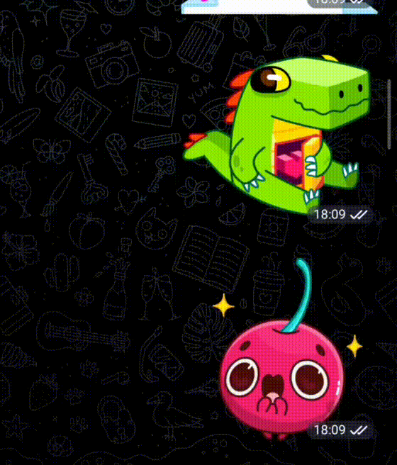

<p align="center">
  
</p>

# Tyche


[](https://codecov.io/gh/floating-morality/tyche)


Telegram bot that randomly picks an item from a list.

## Demo

1. Add [@tyche_random_bot](https://t.me/tyche_random_bot) to your chat.
2. Register items with `/set_items` (replace the whole list) or `/add_item <item>` (append one).
3. Run `/random` — Tyche opens a keyboard so you can deselect anyone, then rolls the dice and announces the winner.

<p align="center">
  
</p>

## Getting started

You have two options:

- **Use the public instance** — just add [@tyche_random_bot](https://t.me/tyche_random_bot) to your chat. No setup required.
- **Self-host your own instance** — if you'd rather run the bot on your own infrastructure (for privacy, control, or fun), follow the instructions below.

## Self-hosting

### 1. Get a bot token

Talk to [@BotFather](https://t.me/BotFather) on Telegram, create a new bot, and copy the token it gives you. You'll pass it to Tyche via the `TYCHE_TLGRM_BOT_TOKEN` environment variable.

### 2. Pick a distribution

Build one of the following from source:

| Format       | Best for                    |
|--------------|-----------------------------|
| Tarball      | Bare-metal deployments      |
| Docker image | Containerized environments  |

---

### Option A — Tarball

**Build the tarball:**

```bash
sbt Universal/packageZipTarball
# → target/universal/tyche-<version>.tgz
```

The archive contains a `bin/tyche` launcher and the application JARs under `lib/`. The host needs a JRE on `PATH` — Tyche is tested on Java 25 ([Eclipse Temurin](https://adoptium.net/) recommended); older versions may work but are not verified.

**Run it:**

```bash
mkdir -p /opt/tyche
tar -xzf tyche-<version>.tgz -C /opt/tyche --strip-components=1
TYCHE_TLGRM_BOT_TOKEN=xxx /opt/tyche/bin/tyche
```

---

### Option B — Docker image

**Build the image:**

```bash
sbt Docker/publishLocal
# → image tagged as tyche:latest
```

**Run it:**

```bash
docker run -d --name tyche \
  -e TYCHE_TLGRM_BOT_TOKEN=xxx \
  -v tyche-data:/opt/docker/data \
  tyche:latest
```

The container persists participant data and logs under `/opt/docker/data`, which is exposed as a volume.

## Why does this exist?

My friends and I like hitting up bars. Bars, however, are deeply allergic to splitting the bill, and nobody carries cash anymore. So one brave soul pays for everyone, and the rest reimburse them later by transfer.
To avoid the same person playing bank every time, we decided to outsource the decision to chance.

And so Tyche was born — named after the Greek goddess of fortune, and also a convenient excuse to play with the Telegram API and Scala 3.
